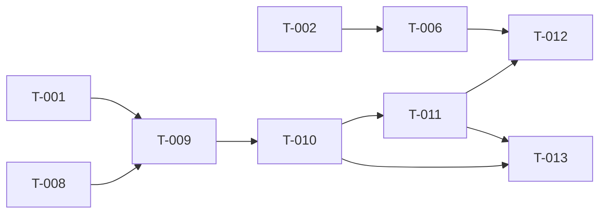

# Build Site

9 tasks across 5 tiers from 2 kits (15 requirements, 50 acceptance criteria — all covered).

**Regeneration notice.** The kits were revised on 2026-07-28 to move the dispatch entry point from `ActionKaironBotResponse.execute()` / the NLG layer to `WhatsappBot.send_custom_json()` in `kairon/chat/handlers/channels/whatsapp.py`. **T-003, T-004, T-005 and T-007 from the previous build site are superseded by this regeneration** and must not be marked complete — the code written for them lives in the wrong layer (`kairon/chat/agent/nlg.py` + `KaironAgent`/`AgentProcessor` wiring) and does not satisfy the revised criteria. T-001, T-002 and T-006 remain valid and are carried forward as COMPLETE. The new delta is T-008 through T-013.

---

## Tier 0 — No Dependencies (Start Here)

| Task | Title | Cavekit | Requirement | blockedBy | Effort | Status |
|------|-------|---------|-------------|-----------|--------|--------|
| T-001 | Add `catalog.url` config entry to system.yaml | cavekit-catalog-url-dispatch.md | R1 | none | S | COMPLETE |
| T-002 | Tests: catalog payload convention, round-trip, non-catalog passthrough via existing endpoints | cavekit-catalog-custom-response.md | R1 (1-3, 7), R2, R3 (1-3), R4 | none | M | COMPLETE |
| T-008 | Cleanup: remove the superseded NLG-layer catalog implementation | — (precondition) | — | none | S | NEW |

## Tier 1 — Depends on Tier 0

| Task | Title | Cavekit | Requirement | blockedBy | Effort | Status |
|------|-------|---------|-------------|-----------|--------|--------|
| T-006 | Optional `label` field storage: accept absent/null/empty/whitespace without validation error, round-trip add/change/remove through the existing create/edit path | cavekit-catalog-custom-response.md | R1 (4-6), R3 (4-5) | T-002 | M | COMPLETE |
| T-009 | Register `"catalog"` in `type_list` and add the catalog branch to `WhatsappBot.send_custom_json` | cavekit-catalog-url-dispatch.md | R2 | T-001, T-008 | M | NEW |

## Tier 2 — Depends on Tier 1

| Task | Title | Cavekit | Requirement | blockedBy | Effort | Status |
|------|-------|---------|-------------|-----------|--------|--------|
| T-010 | Tracker retrieval via `AgentProcessor`, slot/literal identifier resolution, missing-slot drop fallback | cavekit-catalog-url-dispatch.md | R3, R4, R5, R6 | T-009 | L | NEW |

## Tier 3 — Depends on Tier 2

| Task | Title | Cavekit | Requirement | blockedBy | Effort | Status |
|------|-------|---------|-------------|-----------|--------|--------|
| T-011 | Identifier encryption, per-dispatch JWT, URL assembly, plain-text dispatch path | cavekit-catalog-url-dispatch.md | R7, R8, R9, R10 (5-6) | T-010 | M | NEW |

## Tier 4 — Depends on Tier 3

| Task | Title | Cavekit | Requirement | blockedBy | Effort | Status |
|------|-------|---------|-------------|-----------|--------|--------|
| T-012 | Label-conditional link dispatch through the existing `link` converter, exactly-once guard | cavekit-catalog-url-dispatch.md | R10 (1-4, 7) | T-011, T-006 | M | NEW |
| T-013 | Action logging for catalog dispatch (success status + missing-slot failure status) | cavekit-catalog-url-dispatch.md | R11 | T-010, T-011 | M | NEW |

---

## Task Detail — New Tasks

### T-008: Cleanup — remove the superseded NLG-layer catalog implementation
**Cavekit Requirement:** none (precondition for correct validation of T-009 through T-013)
**Acceptance Criteria Mapped:** none directly. Required so that T-009+ criteria are validated against the single revised dispatch path and not masked by a second, stale implementation.
**blockedBy:** none
**Effort:** S
**Description:** Remove the previous-generation catalog dispatch code so exactly one dispatch path exists. Concretely: delete `kairon/chat/agent/nlg.py` (`KaironNLG`); revert the `KaironNLG` wiring in `kairon/chat/agent/agent.py` (`KaironAgent._set_fingerprint`/domain-update block — restore `self.nlg.responses = self.domain.responses if self.domain else {}` and drop the `self.processor.nlg = self.nlg` line and the `KaironNLG` import); revert the two `agent.nlg.bot_id = bot` blocks and the `KaironNLG` import in `kairon/chat/agent_processor.py`; delete `tests/unit_test/chat/test_kairon_nlg.py`. Verify-and-remove-if-present (both are absent in the current working tree, so this is a no-op check, not an edit): a catalog branch in `kairon/actions/definitions/bot_response.py`, and `tests/unit_test/action/test_catalog_bot_response.py`. Also carry forward one correction the old code got wrong so it is not reintroduced: the marker value is `"catalog"`, not `"store_page"`, and the catalog `data` section is a **dict**, not a single-element list (see the T-002/T-006 storage tests, which assert `payload["data"]["label"]`).
**Files:** delete `kairon/chat/agent/nlg.py`, delete `tests/unit_test/chat/test_kairon_nlg.py`, revert `kairon/chat/agent/agent.py`, revert `kairon/chat/agent_processor.py`
**Test Strategy:** Build/import check — `python -c "import kairon.chat.agent.agent, kairon.chat.agent_processor"` must succeed with no dangling `KaironNLG` reference. Run `python -m pytest tests/unit_test/chat/ tests/unit_test/data_processor/data_processor_test.py -k catalog` and confirm the T-002/T-006 storage tests still pass and no NLG catalog test remains collected. `grep -rn "KaironNLG\|store_page" kairon/` returns nothing.
**Time guard:** mechanical — 5 minutes.

### T-009: Register `"catalog"` in `type_list` and add the catalog branch to `send_custom_json`
**Cavekit Requirement:** catalog-url-dispatch/R2
**Acceptance Criteria Mapped:** R2.1, R2.2, R2.3, R2.4
**blockedBy:** T-001, T-008
**Effort:** M
**Description:** Register the catalog type in system metadata and open the dispatch branch. `type_list` is loaded into `Utility.system_metadata` from **`kairon/metadata/message_template.yml`** (`type_list: ["image","link","video","button","quick_reply","dropdown","audio","formatText"]`) — that is the file to edit, notwithstanding the kit's shorthand of "system.yaml"; add `"catalog"` to that list. In `WhatsappBot.send_custom_json` (`kairon/chat/handlers/channels/whatsapp.py`, currently around line 287), branch on `messagetype == "catalog"` **before** the existing `ConverterFactory`/`content_type` lookup, because catalog has no entry in the local `content_type` map and must not fall through to `ConverterFactory.getConcreteInstance`. Delegate the branch body to a private async helper (e.g. `_dispatch_catalog(recipient_id, message, **kwargs)`) so T-010 through T-013 extend one seam; in this task the helper is a stub that only proves routing. Every other `type_list` member keeps the existing converter path, and any type absent from `type_list` keeps the existing `self.send(recipient_id, {"preview_url": True, "body": str(json_message)})` fallback.
**Files:** `kairon/metadata/message_template.yml`, `kairon/chat/handlers/channels/whatsapp.py`, new `tests/unit_test/chat/test_whatsapp_catalog_dispatch.py`
**Test Strategy:** Unit tests. (a) `Utility.load_system_metadata()` then assert `"catalog" in Utility.system_metadata["type_list"]`. (b) Call `send_custom_json` with `{"type": "catalog", "data": {...}}` and assert the catalog helper is invoked and `ConverterFactory.getConcreteInstance` is **not** called. (c) Parametrize over `link`, `image`, `video`, `button`, `dropdown`, `audio`, `formatText` and assert the existing converter + `whatsapp_client.send` path is unchanged (mock the converter, assert call args). (d) Call with `{"type": "unknown_type", ...}` and assert the `preview_url` string fallback fires exactly as before.
**Time guard:** mechanical + test authoring — 15 minutes.

### T-010: Tracker retrieval, identifier resolution, missing-slot fallback
**Cavekit Requirement:** catalog-url-dispatch/R3, R4, R5, R6
**Acceptance Criteria Mapped:** R3.1, R3.2, R4.1, R4.2, R4.3, R5.1, R5.2, R6.1, R6.2
**blockedBy:** T-009
**Effort:** L
**Description:** Fill in the catalog helper's resolution stage. Retrieve the tracker with `AgentProcessor.get_agent(kwargs["assistant_id"]).tracker_store.retrieve(recipient_id)` — note `retrieve` is a coroutine and must be awaited (same pattern as `kairon/chat/handlers/channels/voice.py:177-179`), and the bot id comes from the `assistant_id` kwarg while the sender id is the `recipient_id` positional argument. If `assistant_id` is missing, or `get_agent` raises, or `retrieve` returns falsy, abort: assemble no URL, dispatch nothing, log the failure (`logger.error`) and hand the failure to the T-013 logging seam. Read `page_name`, `identifierType`, `identifierValue`, `label` from the catalog `data` dict. For `identifierType == "slot"`, resolve via `tracker.get_slot(identifierValue)`; a non-empty string is the resolved identifier, while absent, `None`, `""` or whitespace-only is a resolution failure. For `identifierType == "value"`, the resolved identifier is `identifierValue` verbatim and **no** slot read occurs — do not call `tracker.get_slot` on this branch (assert this in tests). On resolution failure take the R6 fallback: no URL assembly, no `whatsapp_client.send`, no `self.send`, and a recorded failure. Return early with a distinguishable outcome so T-013 can attach status without re-deriving it.
**Files:** `kairon/chat/handlers/channels/whatsapp.py`, `tests/unit_test/chat/test_whatsapp_catalog_dispatch.py`
**Test Strategy:** Unit tests with `AgentProcessor.get_agent` patched and an async-mocked `tracker_store.retrieve`. (a) Assert `get_agent` called with the `assistant_id` value and `retrieve` awaited with `recipient_id`. (b) `get_agent` raises / `retrieve` returns `None` → assert no send call of any kind and a logged failure. (c) `identifierType="slot"` with slot value `"CUST123"` → resolved identifier is `"CUST123"` and `get_slot` was called with the `identifierValue` name. (d) Parametrize slot value over `""`, `"   "`, `None`, and slot-not-defined → assert zero dispatch calls and a recorded failure. (e) `identifierType="value"` → resolved identifier equals `identifierValue` exactly and `tracker.get_slot` has call count 0.
**Time guard:** investigation + implementation — split into resolution-logic and test passes if it exceeds 2 hours.

### T-011: Encryption, session token, URL assembly, plain-text dispatch
**Cavekit Requirement:** catalog-url-dispatch/R7, R8, R9, R10 (criteria 5-6)
**Acceptance Criteria Mapped:** R7.1, R7.2, R8.1, R8.2, R8.3, R9.1, R9.2, R9.3, R10.5, R10.6
**blockedBy:** T-010
**Effort:** M
**Description:** Turn the resolved identifier into a delivered URL. Encrypt with `Utility.encrypt_message(resolved_identifier)` — the plaintext identifier must never appear in the URL. Mint a per-dispatch token with `Authentication.create_access_token(data={"sub": recipient_id, "bot": bot_id})`; the token is not persisted anywhere on the response document. Read the base from `Utility.environment["catalog"]["url"]` (T-001) and assemble exactly `f"{catalog_url}/{page_name}/{bot_id}/{encrypted_identifier}?token={token}"`, with `page_name` taken literally from the payload and never slot-resolved. Deliver as plain text when `label` is absent, `None`, `""`, or whitespace-only — use the channel's existing text mechanism, i.e. `self.send(recipient_id, {"preview_url": True, "body": url})`, matching how text responses already go out — and emit no custom payload on this branch. Keep the `label` truthiness test as `if label and label.strip()` so the four "no label" shapes collapse to one branch.
**Files:** `kairon/chat/handlers/channels/whatsapp.py`, `tests/unit_test/chat/test_whatsapp_catalog_dispatch.py`
**Test Strategy:** Unit tests. (a) Patch `Utility.encrypt_message` to a sentinel and assert the URL contains the sentinel and does **not** contain the plaintext identifier, for both `slot` and `value` resolution. (b) Assert the assembled URL string equals the expected `{base}/{page_name}/{bot_id}/{encrypted}?token={token}` composition character-for-character, and that `page_name` appears literally when a slot of the same name holds a different value. (c) Decode the generated token and assert `sub == recipient_id` and `bot == bot_id`; assert two dispatches produce independently generated tokens and that no token is written to the `Responses` document. (d) Parametrize `label` over absent, `None`, `""`, `"   "` → assert `self.send` called once with the URL in `body` and `whatsapp_client.send` not called with a link payload. (e) Assert the base URL is read from `Utility.environment["catalog"]["url"]` (override it in the test env and confirm the URL follows).
**Time guard:** implementation — 2 hours.

### T-012: Label-conditional link dispatch
**Cavekit Requirement:** catalog-url-dispatch/R10 (criteria 1-4, 7)
**Acceptance Criteria Mapped:** R10.1, R10.2, R10.3, R10.4, R10.7
**blockedBy:** T-011, T-006
**Effort:** M
**Description:** When `label` is a non-empty, non-whitespace-only string, deliver the URL as a labeled hyperlink instead of plain text. Build the payload `{"type": "link", "data": [{"children": [{"type": "link", "href": url, "children": [{"text": label}]}]}]}` and push it through the **existing** `link` conversion path — resolve `ConverterFactory.getConcreteInstance("link", ChannelTypes.WHATSAPP.value)`, `await converter_instance.messageConverter(data)`, then `self.whatsapp_client.send(response, recipient_id, "text")` using the `content_type["link"] == "text"` messaging type already in `send_custom_json`. Introduce no new payload type and no new converter class. Guard the branch so the URL is delivered exactly once per dispatch: link **or** text, never both, and never zero times on the success path — structure it as a single if/else over the label predicate with one send site per arm, not two independent conditionals.
**Files:** `kairon/chat/handlers/channels/whatsapp.py`, `tests/unit_test/chat/test_whatsapp_catalog_dispatch.py`
**Test Strategy:** Unit tests. (a) `label="View Catalog"` → assert the payload handed to the converter equals the required nested structure exactly (deep-equal on `[{"children": [{"type": "link", "href": <url>, "children": [{"text": "View Catalog"}]}]}]`). (b) Assert `href` equals the T-011 assembled URL and the `text` equals the label verbatim, including a label with leading/trailing spaces around real content and a label with unicode/punctuation. (c) Assert `ConverterFactory.getConcreteInstance` was called with `"link"` and that no new type was registered in `type_list` beyond `"catalog"`. (d) Exactly-once: total dispatch call count across `self.send` and `whatsapp_client.send` is 1 in the link branch and 1 in the text branch; assert the link branch never calls `self.send` and the text branch never calls the link converter. (e) End-to-end confirmation of custom-response R1.6 — a stored payload whose `label` is empty/whitespace (persisted per T-006) dispatches as plain text.
**Time guard:** implementation — 2 hours.

### T-013: Action logging for catalog dispatch
**Cavekit Requirement:** catalog-url-dispatch/R11
**Acceptance Criteria Mapped:** R11.1, R11.2
**blockedBy:** T-010, T-011
**Effort:** M
**Description:** Record every catalog dispatch attempt. Write an `ActionServerLogs` entry (`kairon/shared/actions/data_objects.py:263`) from the catalog helper — note this is the first `ActionServerLogs` write originating in `kairon/chat/`, so import it locally inside the helper to avoid widening chat-server import surface, and wrap the write in try/except so a logging failure never suppresses or duplicates a user-facing dispatch. Populate the action name (the utterance/action identifier available at dispatch, falling back to a stable constant such as `"catalog_dispatch"` when the channel payload carries no action name), `bot`, `sender`, and status. Status is `SUCCESS` when the URL was delivered (link or text) and `FAILURE` for the R6 missing-slot fallback and for the R3.2 tracker-retrieval failure. Log exactly one entry per dispatch attempt.
**Files:** `kairon/chat/handlers/channels/whatsapp.py`, `tests/unit_test/chat/test_whatsapp_catalog_dispatch.py`
**Test Strategy:** Unit tests with the `ActionServerLogs` write patched. (a) Successful link dispatch and successful text dispatch each produce exactly one log entry carrying the action name and `SUCCESS` status. (b) Missing-slot fallback (slot absent/null/empty/whitespace) produces exactly one entry with `FAILURE` status and no dispatch. (c) Tracker-retrieval failure produces a `FAILURE` entry. (d) Raise from the log write and assert the dispatch outcome is unchanged (still exactly one send on the success path, still zero on the fallback path).
**Time guard:** implementation — 2 hours.

---

## Summary

| Task | Tier | Effort | Cavekit | Requirements | blockedBy | Status |
|------|------|--------|---------|--------------|-----------|--------|
| T-001 | 0 | S | cavekit-catalog-url-dispatch.md | R1 | none | COMPLETE |
| T-002 | 0 | M | cavekit-catalog-custom-response.md | R1 (1-3, 7), R2, R3 (1-3), R4 | none | COMPLETE |
| T-008 | 0 | S | — (precondition) | — | none | NEW |
| T-006 | 1 | M | cavekit-catalog-custom-response.md | R1 (4-6), R3 (4-5) | T-002 | COMPLETE |
| T-009 | 1 | M | cavekit-catalog-url-dispatch.md | R2 | T-001, T-008 | NEW |
| T-010 | 2 | L | cavekit-catalog-url-dispatch.md | R3, R4, R5, R6 | T-009 | NEW |
| T-011 | 3 | M | cavekit-catalog-url-dispatch.md | R7, R8, R9, R10 (5-6) | T-010 | NEW |
| T-012 | 4 | M | cavekit-catalog-url-dispatch.md | R10 (1-4, 7) | T-011, T-006 | NEW |
| T-013 | 4 | M | cavekit-catalog-url-dispatch.md | R11 | T-010, T-011 | NEW |

### Tier breakdown

| Tier | Tasks | Count | Complete | Remaining |
|------|-------|-------|----------|-----------|
| 0 | T-001, T-002, T-008 | 3 | 2 | 1 |
| 1 | T-006, T-009 | 2 | 1 | 1 |
| 2 | T-010 | 1 | 0 | 1 |
| 3 | T-011 | 1 | 0 | 1 |
| 4 | T-012, T-013 | 2 | 0 | 2 |

**Total: 9 tasks, 5 tiers** (3 COMPLETE, 6 remaining)

Superseded from the previous build site: T-003, T-004, T-005, T-007. Their IDs are retired and not reused.

---

## Coverage Matrix (50 ACs, all COVERED)

| Kit | Req | Criterion (abbreviated) | Task | Status |
|-----|-----|--------------------------|------|--------|
| cavekit-catalog-custom-response.md | R1.1 | top-level marker field = `"catalog"` | T-002 (COMPLETE) | COVERED |
| cavekit-catalog-custom-response.md | R1.2 | data section holds page name, identifier type, identifier value | T-002 (COMPLETE) | COVERED |
| cavekit-catalog-custom-response.md | R1.3 | identifier type = exactly `"slot"` or `"value"` | T-002 (COMPLETE) | COVERED |
| cavekit-catalog-custom-response.md | R1.4 | data section MAY contain `label`; optional string, any value incl. empty | T-006 (COMPLETE) | COVERED |
| cavekit-catalog-custom-response.md | R1.5 | saving with `label` absent/null/empty/whitespace → no validation error | T-006 (COMPLETE) | COVERED |
| cavekit-catalog-custom-response.md | R1.6 | absent/null/empty/whitespace `label` treated as no label → plain text at dispatch | T-006 (COMPLETE, storage side); T-012 (NEW, dispatch side) | COVERED |
| cavekit-catalog-custom-response.md | R1.7 | marker other than `"catalog"` → plain custom response | T-002 (COMPLETE) | COVERED |
| cavekit-catalog-custom-response.md | R2.1 | create via existing custom-response endpoint, no endpoint change | T-002 (COMPLETE) | COVERED |
| cavekit-catalog-custom-response.md | R2.2 | edit via existing custom-response endpoint, no endpoint change | T-002 (COMPLETE) | COVERED |
| cavekit-catalog-custom-response.md | R2.3 | stored in the same `custom` slot as non-catalog custom responses | T-002 (COMPLETE) | COVERED |
| cavekit-catalog-custom-response.md | R3.1 | fetch returns marker = `"catalog"` | T-002 (COMPLETE) | COVERED |
| cavekit-catalog-custom-response.md | R3.2 | fetch returns saved page name, identifier type, identifier value | T-002 (COMPLETE) | COVERED |
| cavekit-catalog-custom-response.md | R3.3 | edit then fetch returns updated values | T-002 (COMPLETE) | COVERED |
| cavekit-catalog-custom-response.md | R3.4 | save with `label` → fetch returns equal `label` | T-006 (COMPLETE) | COVERED |
| cavekit-catalog-custom-response.md | R3.5 | edit to add/change/remove `label` → fetch reflects update incl. absence | T-006 (COMPLETE) | COVERED |
| cavekit-catalog-custom-response.md | R4.1 | non-catalog custom saves/fetches with payload unchanged | T-002 (COMPLETE) | COVERED |
| cavekit-catalog-custom-response.md | R4.2 | non-catalog custom never reinterpreted as catalog on fetch | T-002 (COMPLETE) | COVERED |
| cavekit-catalog-url-dispatch.md | R1.1 | system config has a catalog section with a url key | T-001 (COMPLETE) | COVERED |
| cavekit-catalog-url-dispatch.md | R1.2 | base catalog URL readable by the dispatch runtime after config load | T-001 (COMPLETE) | COVERED |
| cavekit-catalog-url-dispatch.md | R1.3 | url key supports env-var interpolation | T-001 (COMPLETE) | COVERED |
| cavekit-catalog-url-dispatch.md | R2.1 | `"catalog"` present in `type_list` in system metadata | T-009 (NEW) | COVERED |
| cavekit-catalog-url-dispatch.md | R2.2 | `send_custom_json` with `messagetype == "catalog"` → catalog path taken | T-009 (NEW) | COVERED |
| cavekit-catalog-url-dispatch.md | R2.3 | any other `type_list` type → existing dispatch unchanged | T-009 (NEW) | COVERED |
| cavekit-catalog-url-dispatch.md | R2.4 | type absent from `type_list` → existing fallback unchanged | T-009 (NEW) | COVERED |
| cavekit-catalog-url-dispatch.md | R3.1 | calls `AgentProcessor.get_agent(bot_id).tracker_store.retrieve(sender_id)` via `assistant_id` kwarg + `recipient_id` | T-010 (NEW) | COVERED |
| cavekit-catalog-url-dispatch.md | R3.2 | tracker retrieval failure → no URL, no dispatch, failure logged | T-010 (NEW); status recorded by T-013 (NEW) | COVERED |
| cavekit-catalog-url-dispatch.md | R4.1 | identifier type `"slot"` → read slot named by identifier value from tracker | T-010 (NEW) | COVERED |
| cavekit-catalog-url-dispatch.md | R4.2 | slot present + non-empty string → its value is the resolved identifier | T-010 (NEW) | COVERED |
| cavekit-catalog-url-dispatch.md | R4.3 | slot present + empty string → treated as absent/null (R6 fallback) | T-010 (NEW) | COVERED |
| cavekit-catalog-url-dispatch.md | R5.1 | identifier type `"value"` → resolved identifier equals identifier value verbatim | T-010 (NEW) | COVERED |
| cavekit-catalog-url-dispatch.md | R5.2 | literal resolution reads no conversation slot | T-010 (NEW) | COVERED |
| cavekit-catalog-url-dispatch.md | R6.1 | slot absent/null/empty → no URL assembled, no message dispatched | T-010 (NEW) | COVERED |
| cavekit-catalog-url-dispatch.md | R6.2 | failure recorded in the action log for that dispatch | T-013 (NEW) | COVERED |
| cavekit-catalog-url-dispatch.md | R7.1 | URL identifier segment is the encrypted form, not plaintext | T-011 (NEW) | COVERED |
| cavekit-catalog-url-dispatch.md | R7.2 | encryption applied to the resolved identifier from R4 or R5 | T-011 (NEW) | COVERED |
| cavekit-catalog-url-dispatch.md | R8.1 | token carries the conversation sender id under `sub` | T-011 (NEW) | COVERED |
| cavekit-catalog-url-dispatch.md | R8.2 | token carries the bot id under `bot` | T-011 (NEW) | COVERED |
| cavekit-catalog-url-dispatch.md | R8.3 | token generated per dispatch, not stored on the response | T-011 (NEW) | COVERED |
| cavekit-catalog-url-dispatch.md | R9.1 | URL structure `{catalog_url}/{page_name}/{bot_id}/{encrypted_identifier}?token={token}` | T-011 (NEW) | COVERED |
| cavekit-catalog-url-dispatch.md | R9.2 | page name segment used literally, not slot-resolved | T-011 (NEW) | COVERED |
| cavekit-catalog-url-dispatch.md | R9.3 | base from R1, encrypted identifier from R7, token from R8 | T-011 (NEW) | COVERED |
| cavekit-catalog-url-dispatch.md | R10.1 | non-empty non-whitespace `label` → dispatch custom payload of the existing `link` type | T-012 (NEW) | COVERED |
| cavekit-catalog-url-dispatch.md | R10.2 | link target = assembled URL (R9); visible text = `label` verbatim | T-012 (NEW) | COVERED |
| cavekit-catalog-url-dispatch.md | R10.3 | link data structure `[{"children": [{"type": "link", "href": ..., "children": [{"text": ...}]}]}]` | T-012 (NEW) | COVERED |
| cavekit-catalog-url-dispatch.md | R10.4 | uses the already-supported `link` type via the existing converter; no new type | T-012 (NEW) | COVERED |
| cavekit-catalog-url-dispatch.md | R10.5 | `label` absent or null → URL dispatched as plain text via the text-message mechanism | T-011 (NEW) | COVERED |
| cavekit-catalog-url-dispatch.md | R10.6 | `label` empty or whitespace-only → treated as absent, plain text dispatch | T-011 (NEW) | COVERED |
| cavekit-catalog-url-dispatch.md | R10.7 | URL delivered exactly once per dispatch — link or text, never both | T-012 (NEW) | COVERED |
| cavekit-catalog-url-dispatch.md | R11.1 | dispatch produces an action log entry recording the action name | T-013 (NEW) | COVERED |
| cavekit-catalog-url-dispatch.md | R11.2 | success → success status; missing-slot fallback → failure status | T-013 (NEW) | COVERED |

**Coverage: 50/50 criteria (100%). 0 GAPS.**

Attribution: 17 criteria are satisfied by the three carried-forward COMPLETE tasks (T-001: 3, T-002: 11, T-006: 5 — R1.6 is shared between T-006 and T-012). The remaining 33 dispatch criteria are re-planned onto the revised `send_custom_json` entry point across T-009 through T-013. T-008 maps to no criterion; it is a precondition that removes the superseded NLG implementation so the T-009+ criteria are validated against a single dispatch path.

---

## Dependency Graph

**Parallelization notes:**
- Tier 0 (`T-001`, `T-002`, `T-008`) has no dependencies. `T-001` and `T-002` are COMPLETE, so `T-008` is the only immediately actionable Tier 0 work.
- `T-006` is COMPLETE and its only blocker (`T-002`) is COMPLETE, so the `label` storage branch of the graph is fully settled; it re-enters the graph only as a blocker on `T-012`.
- Critical path: `T-008 → T-009 → T-010 → T-011 → T-012`. Five sequential tasks, and the whole dispatch chain is strictly serial because each stage extends the same catalog helper in `send_custom_json`.
- `T-012` and `T-013` are the only pair that can run in parallel: both unblock once `T-011` lands (`T-013` additionally needs `T-010`, already done by then), and they touch disjoint concerns — link payload shape versus log-entry writes. Expect a merge point in the same file, so coordinate the helper's return-value contract in `T-010`.
- Graph is acyclic. No [CONDITIONAL] or [DYNAMIC] tasks in this plan.

**Planning corrections carried into the tasks** (discovered while grounding the plan against the tree, worth flagging to the builder):
- `type_list` lives in `kairon/metadata/message_template.yml`, not `system.yaml`; the kit's R2.1 wording is shorthand for "system metadata".
- `tracker_store.retrieve` is a coroutine — the superseded NLG code never had to await it, the new path does.
- The catalog `data` section is a dict; the superseded code indexed it as `data[0]`.
- The superseded code used the marker `"store_page"`; the kits and the T-002/T-006 storage tests require `"catalog"`.
