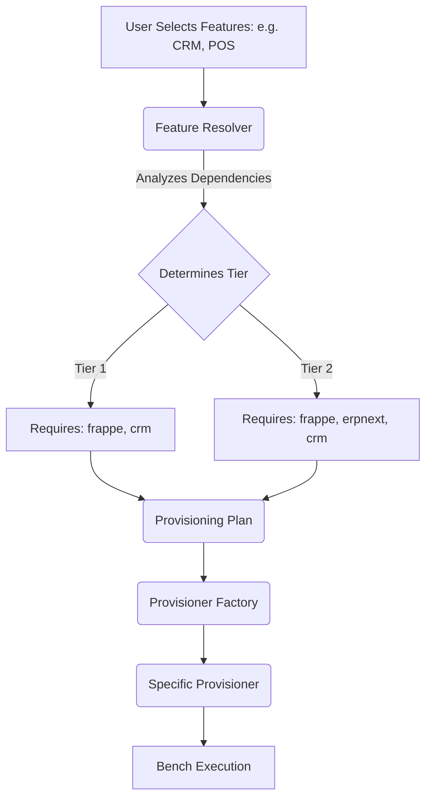
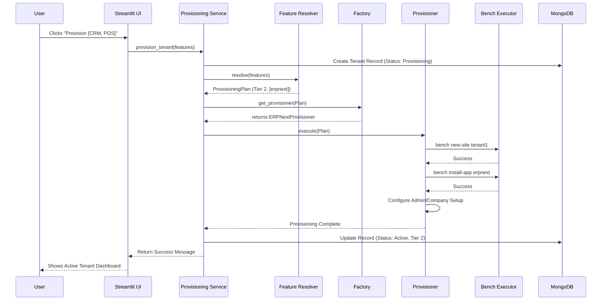

# Kairon Hybrid Provisioning Framework
*Technical Architecture & Implementation Guide*

---

## 1. Why was this architecture needed?

### The Old Provisioning Flow
Previously, Kairon could only provision one type of tenant: a full **ERPNext** instance. Regardless of what the user actually needed (e.g., just a simple CRM), the system would install the complete ERPNext monolith.

### Limitations of the Old Approach
- **Bloat and Resource Usage**: ERPNext is a massive application containing modules for Manufacturing, Accounting, HR, etc. Installing it for every tenant consumed significant memory, CPU, and database resources unnecessarily.
- **Slow Provisioning**: Setting up a full ERPNext site takes considerably longer due to the large number of database tables and fixtures that must be created.
- **Complexity**: It presented a cluttered interface to users who only wanted a simple CRM, as they were exposed to features they didn't need.

### Why ERPNext Alone Couldn't Solve It
ERPNext is a monolithic application. While it offers a CRM module, you cannot simply "turn off" the underlying ERP architecture. If a user only wanted a lightweight CRM, they were still burdened by the overhead of the entire ERP suite.

### The Value of Standalone Frappe Apps
Frappe allows developers to build lightweight, focused applications (like `crm` and `helpdesk`) that run independently on the Frappe framework without requiring ERPNext. These apps are fast, modern, and consume far fewer resources.

### Why Hybrid Provisioning?
We needed a system that was smart enough to say:
- *"If the user only wants CRM, give them the fast, lightweight standalone CRM app."*
- *"If the user wants POS, Manufacturing, or HR, they need the full ERPNext monolith, so give them ERPNext."*
- *"If a user starts with CRM, and later wants POS, smoothly upgrade their tenant to ERPNext."*

This is the **Hybrid Provisioning Framework**—an intelligent system that dynamically provisions the exact tier of applications required, minimizing bloat while maximizing capabilities.

---

## 2. Understanding Bench

### What is Bench?
Bench is the official command-line utility (CLI) for managing Frappe and ERPNext deployments. It is the core engine that creates sites, installs applications, and manages background workers.

### Why use Bench instead of manual database creation?
A Frappe "site" is not just a database. Creating a site involves:
1. Creating a MariaDB/PostgreSQL database.
2. Building hundreds of core Frappe schema tables.
3. Seeding the database with essential administrative fixtures (roles, core settings).
4. Generating unique encryption keys (site_config.json).
Bench automates this complex orchestration.

### Key Bench Commands Explained

#### `bench new-site [site-name]`
- **What it does**: Creates a brand new, empty Frappe site (database and configuration).
- **When it is used**: As the very first step of provisioning any new tenant.
- **What happens internally**: Bench connects to the database server, creates a new database, installs the core Frappe framework tables, and generates the `site_config.json` containing the database credentials. At this point, the site has NO apps installed (neither CRM nor ERPNext).

#### `bench --site [site-name] install-app [app-name]`
- **What it does**: Installs a specific application onto an existing site.
- **When it is used**: Immediately after `new-site`, or during an upgrade.
- **Examples**:
  - `bench --site tenant1.localhost install-app crm`
  - `bench --site tenant2.localhost install-app erpnext`
- **What happens internally**: Bench reads the app's schema, creates the app-specific database tables, and inserts default data (like standard Workflows or Custom Fields) into the site's database.

#### `bench --site [site-name] backup`
- **What it does**: Takes a complete snapshot of the database and files.
- **When it is used**: Right before we upgrade a CRM-only tenant to a full ERPNext tenant.
- **Why it is used**: To ensure zero data loss in case the upgrade fails.

#### `bench --site [site-name] migrate`
- **What it does**: Runs database schema updates and synchronizes the database with the application code.
- **When it is used**: After installing a new app on an existing site, or after upgrading an application.
- **What happens internally**: Frappe checks if any `DocTypes` (schemas) have changed in the code and alters the database tables to match the new definitions.

---

## 3. The Biggest Change: `crm` vs `erpnext`

### The Shift in Strategy
Previously, our primary command was always:
`bench --site [site] install-app erpnext`

Now, for Tier 1 users, we run:
`bench --site [site] install-app crm`

### Why is this possible?
Frappe recently decoupled `crm` and `helpdesk` from the main ERPNext monolith. They are now **standalone apps** that only depend on the base Frappe framework.

### How Standalone Apps Differ from ERPNext
- **Standalone Apps (CRM, Helpdesk)**: Highly focused, fast, and only contain exactly what is needed for that specific domain. They are separate repositories.
- **ERPNext**: The giant monolith. It contains Accounting, Stock, POS, Manufacturing, etc.

### Why POS cannot be installed separately
POS (Point of Sale) deeply relies on Stock ledgers, Accounting GL Entries, and Tax rules. Therefore, POS is permanently embedded inside the ERPNext monolith. If a user selects POS, we have no choice but to install full ERPNext.

### Why CRM can be
A CRM primarily deals with Leads, Deals, and Notes. It doesn't need to know about double-entry accounting or warehouse inventory. Therefore, it thrives as a lightweight, independent application.

---

## 4. Feature Resolution

The Feature Resolver is the brain of the framework. It translates user desires into a concrete technical plan.

**Steps:**
1. **Input**: A list of requested features `["crm", "pos"]`
2. **Analysis**: The `FeatureResolver` maps features to actual Frappe apps (e.g., POS maps to `erpnext`).
3. **Tier Calculation**: If *any* selected app is a monolith (like `erpnext` or `hrms`), the entire tenant is escalated to **Tier 2**. If all apps are standalone (like `crm`), it remains **Tier 1**.
4. **Output**: It generates a `ProvisioningPlan`.

---

## 5. ProvisioningPlan

### What is it?
`ProvisioningPlan` is a simple Python data class that holds the output of the `FeatureResolver`.

### What information it contains:
- `tier`: The calculated tier (Tier 1 or Tier 2).
- `apps_to_install`: The exact list of Frappe apps required (e.g., `["crm", "helpdesk"]`).
- `requires_upgrade`: A boolean indicating if this is a new installation or an upgrade of an existing site.

### Why we introduced it
Previously, code was littered with `if "erpnext" in features: ... else: ...`. This was unmaintainable. By encapsulating this in a `ProvisioningPlan`, we removed hardcoded if-statements. The rest of the system simply blindly executes the "Plan" without needing to know *why* the plan was chosen.

---

## 6. ProvisionerFactory

### Why the Factory Pattern?
The system now has multiple ways to provision a tenant (CRM only, ERPNext, or Upgrading). Instead of a massive function that tries to do everything, we created specialized classes. The Factory's job is to look at the `ProvisioningPlan` and return the correct class to handle it.

### Selection Logic:
- If `plan.requires_upgrade` is True → returns `AppUpgradeProvisioner`
- If `plan.tier == Tier 2` → returns `ERPNextProvisioner`
- If `plan.tier == Tier 1` → returns `CRMProvisioner`

---

## 7. The Provisioners

All provisioners inherit from `BaseProvisioner`, sharing common logic like database connectivity checks and exception handling.

### CRMProvisioner
- **Responsibilities**: Provisioning lightweight Tier 1 tenants.
- **Bench Commands**:
  1. `bench new-site [site]`
  2. `bench --site [site] install-app crm` (and/or helpdesk)
- **Configuration**: Sets up standard CRM roles and default views.
- **MongoDB**: Updates tenant record to Tier 1, saves installed apps list.

### ERPNextProvisioner
- **Responsibilities**: Provisioning heavy Tier 2 monoliths.
- **Bench Commands**:
  1. `bench new-site [site]`
  2. `bench --site [site] install-app erpnext`
  3. `bench --site [site] install-app hrms` (if requested)
- **Configuration**: Executes the ERPNext setup wizard programmatically (company creation, base currency, chart of accounts).
- **MongoDB**: Updates tenant record to Tier 2.

### AppUpgradeProvisioner
- **Responsibilities**: Carefully escalating an existing Tier 1 tenant to Tier 2.
- **Validation**: Ensures the site actually exists and isn't already Tier 2.

---

## 8. Upgrade Flow (Tier 1 → Tier 2)

Upgrading is a delicate process handled by the `AppUpgradeProvisioner`.

**The Flow:**
1. **Backup**: `bench --site [tenant] backup` (Ensures we can rollback if the install fails).
2. **Install ERPNext**: `bench --site [tenant] install-app erpnext`. Bench will inject ERPNext tables into the existing CRM database.
3. **Migrate**: `bench --site [tenant] migrate`. Rebuilds indexes and synchronizes the combined schemas.
4. **Reload**: Restarts Frappe/Gunicorn to clear caching so the new ERPNext routes become active.
5. **Mongo Update**: Kairon updates MongoDB, marking the tenant as `Tier 2`, unlocking ERPNext UI features in the Streamlit portal.

---

## 9. The Importance of `install-app crm`

Introducing `bench install-app crm` (and separating it from ERPNext) is the most critical architectural improvement.

- **Speed**: Installing `crm` takes ~30 seconds. Installing `erpnext` takes ~3-4 minutes.
- **Resource Usage**: A CRM-only database is a few megabytes. An ERPNext database is heavily seeded with hundreds of tables.
- **Cleaner Tenant**: The end user doesn't see accounting menus, manufacturing dashboards, or stock ledgers. They only see what they paid for.
- **Just-in-Time Architecture**: ERPNext is now treated as an "escalation module". It is strictly reserved for users who genuinely require ERP capabilities.

---

## 10. Real World Examples

### Example 1: Customer selects [CRM]
- **Resolver**: Maps to `["crm"]`. Determines Tier 1.
- **Plan**: `tier=1, apps=["crm"]`
- **Commands**:
  - `bench new-site abc.localhost`
  - `bench --site abc.localhost install-app crm`
- **Final Tenant**: A fast, lightweight CRM instance.

### Example 2: Customer selects [CRM, Helpdesk]
- **Resolver**: Maps to `["crm", "helpdesk"]`. Determines Tier 1.
- **Plan**: `tier=1, apps=["crm", "helpdesk"]`
- **Commands**:
  - `bench new-site abc.localhost`
  - `bench --site abc.localhost install-app crm`
  - `bench --site abc.localhost install-app helpdesk`

### Example 3: Customer selects [POS]
- **Resolver**: Maps POS to dependency `erpnext`. Determines Tier 2.
- **Plan**: `tier=2, apps=["erpnext"]`
- **Why no `install-app pos`?**: POS is not a standalone app; it is a module embedded inside ERPNext.
- **Commands**:
  - `bench new-site abc.localhost`
  - `bench --site abc.localhost install-app erpnext`

### Example 4: Upgrade from CRM to ERPNext
- **Current State**: Tier 1 (CRM). User clicks "Add POS".
- **Resolver**: Detects request requires Tier 2.
- **Plan**: `tier=2, requires_upgrade=True, apps=["erpnext"]`
- **Commands**:
  - `bench --site abc.localhost backup`
  - `bench --site abc.localhost install-app erpnext`
  - `bench --site abc.localhost migrate`

---

## 11. MongoDB as the Source of Truth

Why does Kairon use MongoDB to store Tenant states instead of relying entirely on Frappe/Bench?

- **Centralized Orchestration**: We might have 50 different Frappe sites. We need one central place to see all tenants, who owns them, and what their status is.
- **Separation of Concerns**: Frappe is the execution engine. MongoDB is Kairon's brain.
- **Provisioning Status**: MongoDB tracks `Provisioning`, `Active`, `Failed`, `Upgrading`. Frappe doesn't know about these Kairon-specific states.
- **Ownership**: Frappe doesn't know about our Streamlit User accounts. MongoDB binds a Streamlit user to a Frappe tenant.
- **Tier Tracking**: Streamlit uses the MongoDB Tier field to determine which UI buttons to show the user instantly, without querying the Bench server.

---

## 12. Streamlit and the Service Layer

Streamlit is strictly a **UI framework**.

- **No Direct Execution**: Streamlit NEVER calls `bench` directly or runs `subprocess.run()`.
- **Delegation**: When a user clicks "Provision", Streamlit calls `ProvisioningService.provision_tenant()`.
- **Why?**: This enforces a strict **Service Layer architecture**. It ensures that if we build a React frontend or a REST API tomorrow, the provisioning logic remains perfectly intact in the backend, decoupled from the UI.

---

## 13. Complete Architecture Flow

---

## 14. Design Patterns Used

1. **Strategy Pattern**: The `BaseProvisioner` defines an interface (`execute()`). The subclasses (`CRMProvisioner`, `ERPNextProvisioner`) implement different strategies for achieving a provisioned site.
2. **Factory Pattern**: `ProvisionerFactory` abstracts away the logic of deciding *which* strategy to use based on the input plan.
3. **Service Layer**: `ProvisioningService` acts as a facade, hiding all this complexity from the Streamlit frontend.
4. **Configuration Driven Design**: The `FeatureResolver` uses a predefined mapping dictionary to map features to apps, rather than hardcoded logic.
5. **Dependency Injection**: Services (like MongoDB clients or Bench Executors) are passed into provisioners, making the code modular and easily testable (e.g., passing a MockBenchExecutor during unit tests).

---

## 15. Production Benefits

- **Scalability**: Tier 1 tenants take up almost no space. We can host thousands of CRM instances on a single server, reserving heavy compute only for Tier 2 customers.
- **Maintainability**: New apps (like `wiki` or `lms`) can be supported simply by adding one line to the `FeatureResolver` mapping. The rest of the pipeline handles it automatically.
- **Extensibility**: If we need a new way to provision (e.g., Docker Swarm Provisioner), we just add a new class to the Factory.
- **Performance**: Reduced provisioning time from 4 minutes down to 30 seconds for the majority of new users (who just want CRM).

---

## 16. End-to-End Walkthrough

*Scenario: User clicks "Create Tenant" selecting "Helpdesk" and "CRM".*

1. **UI Action**: User submits the Streamlit form on `2_CRM_Onboarding.py`.
2. **Service Invocation**: UI calls `tenant_service.create_tenant(features=["crm", "helpdesk"])`.
3. **Pre-flight Validation**: `PreflightValidator` checks if the tenant name is valid and available.
4. **Database Initialization**: A new record is inserted into MongoDB with status `Provisioning`.
5. **Resolution**: `FeatureResolver` looks at `["crm", "helpdesk"]`. Neither is a monolith. It generates a `ProvisioningPlan(tier=1, apps=["crm", "helpdesk"])`.
6. **Factory Delegation**: `ProvisionerFactory` receives the plan and instantiates a `CRMProvisioner`.
7. **Execution Starts**: `CRMProvisioner.execute()` begins.
8. **Bench Commands**:
   - Executes `bench new-site {tenant_url} --admin-password {pwd}` via `BaseProvisioner._bench_new_site`.
   - Executes `bench --site {tenant_url} install-app crm`.
   - Executes `bench --site {tenant_url} install-app helpdesk`.
   - **Known limitation**: `--admin-password` is passed as a `subprocess.run` argv entry (not via a shell string, so it is not exposed through shell history), but it is still visible for the command's duration to anything reading the container's process list (e.g. `docker top`, `ps aux` inside the container). This is a real, currently-open gap -- Frappe's `bench new-site` CLI does not document a stdin/env-var alternative to `--admin-password` as of this writing. Track and re-evaluate if/when `bench` adds one.
9. **Post-Provisioning Config**: The provisioner uses API calls to set up the default Administrator user profile and assigns standard CRM roles.
10. **Validation**: `ProvisionVerifier` attempts to ping the new Frappe site's API to ensure it responds with `200 OK`.
11. **Finalization**: `ProvisioningService` catches the success event and updates MongoDB: `status="Active"`, `tier=1`, `installed_apps=["crm", "helpdesk"]`.
12. **UI Update**: Streamlit refreshes, and the user sees their new tenant ready for login!
